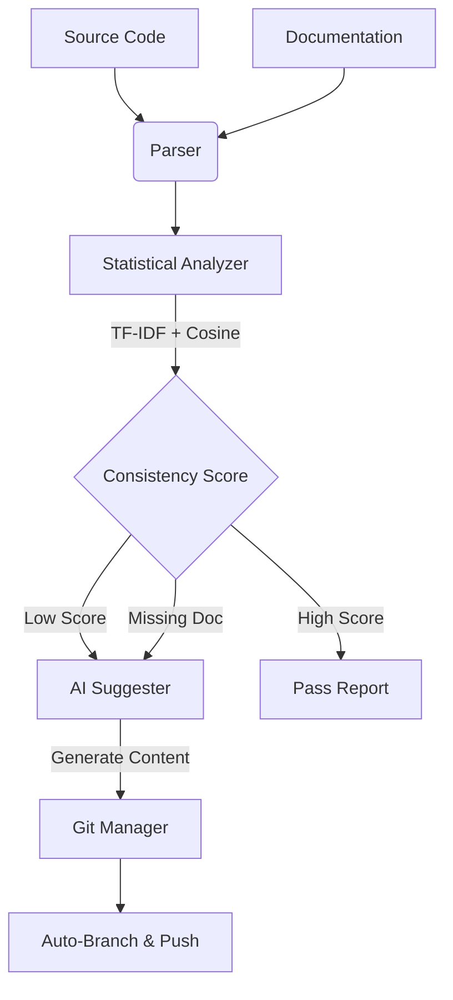

# 🤖 CraftAI - DocSync Agent
...
The **CraftAI - DocSync Agent** is an advanced AI-powered pipeline designed to solve the chronic problem of **Documentation Drift**. Unlike standard linters that check for the *presence* of docstrings, this agent uses **Semantic Analysis** and **Machine Learning** to verify that your documentation actually *matches* the behavior of your code.

---

## 📖 Table of Contents

- [🚀 Overview](#-overview)
- [✨ Key Features](#-key-features)
- [🏗️ System Architecture](#-system-architecture)
- [🛠️ Installation](#-installation)
- [💻 Usage](#-usage)
    - [Web Interface](#web-interface-ad-hoc-analysis)
    - [CLI Pipeline](#cli-pipeline-automation)
    - [Git Automation](#git-automation)
- [⚙️ Configuration](#-configuration)
- [🤖 CI/CD Integration](#-cicd-integration)
- [👨‍💻 Tech Stack](#-tech-stack)

---

## 🚀 Overview

In agile environments, code changes frequently. Updating documentation is often an afterthought. This leads to:
*   **Onboarding Friction**: New engineers read outdated docs.
*   **API Misuse**: Consumers rely on incorrect parameter descriptions.
*   **Technical Debt**: Accumulation of "dead" documentation.

This agent acts as a **guardian**, running alongside your code to ensure:
1.  **Existence**: Every function has documentation.
2.  **Accuracy**: The documentation semantically describes the code's logic.
3.  **Freshness**: Fixes are auto-generated and proposed via Pull Requests.

---

## ✨ Key Features

### 🧠 1. Semantic Consistency Analysis (The "Brain")
*   **TF-IDF Vectorization**: Converts code tokens and documentation text into high-dimensional vectors.
*   **Cosine Similarity**: Measures the angle between vectors to determine valid semantic overlap.
*   **Noise Reduction**: Filters out syntax characters (`(){};`) to focus on variable names, logic keywords, and comments.
*   **Verification Levels**:
    *   ✅ **Excellent (> 0.60)**: High alignment.
    *   ⚠️ **Moderate (> 0.35)**: Vague or partial match.
    *   ❌ **Poor (< 0.35)**: Critical mismatch or drift (e.g., function renamed but doc unchanged).

### ⚡ 2. CraftAI Automated Pipeline
*   **Auto-Discovery**: Recursively scans `src/` (Python) and `docs/` (Markdown).
*   **Gap Analysis**: Identifies specific terms found in code but missing in docs (and vice versa).
*   **Auto-Correction**: Uses **OpenAI GPT-4o-mini** to generate missing documentation or suggest rewrites for drifted docs.

### 🌐 3. Interactive Analysis Dashboard
*   A clean **Web UI** for ad-hoc checks.
*   Upload source files or paste text directly.
*   Visual reports with color-coded "Verdicts" and detailed "Why?" reasoning.

---

## 🏗️ System Architecture



---

## 🛠️ Installation

### Prerequisites
*   Python 3.8 or higher
*   Git installed and configured
*   (Optional) OpenAI API Key (for auto-generation features)

### 1. Clone the Repository
```bash
git clone https://github.com/Mahek-makwana/doc-consistency-agent.git
cd doc-consistency-agent
```

### 2. Install Dependencies
```bash
pip install -r requirements.txt
```

### 3. Set Up Environment
Create a `.env` file (optional) if you want AI generation features:
```bash
export OPENAI_API_KEY="sk-..."
```

---

## 💻 Usage

### Web Interface (Ad-Hoc Analysis)
Best for checking individual files or quick tests.

1.  Start the server:
    ```bash
    python src/agent/main.py
    ```
2.  Open your browser to: **[http://localhost:8000](http://localhost:8000)**
3.  Upload your `.py` file and corresponding `.md` file.
4.  View the semantic score, shared vocabulary, and fix suggestions.

### CLI Pipeline (Automation)
Best for running locally before pushing code.

```bash
# Run analysis and save report to output/
python src/agent/main.py --mode pipeline --ci
```

### Git Automation (The "CraftAI" Flow)
Best for background agents. This will **create a branch**, **commit fixes**, and **push** to GitHub automatically.

```bash
python src/agent/main.py --mode pipeline --ci --git-ops
```

**What happens?**
1.  Agent scans the repo.
2.  Finds missing docs → Generates them.
3.  Finds bad docs → Generates updates.
4.  Creates branch `craftai-auto-docs-<timestamp>`.
5.  Pushes to `origin` and prints a PR description.

---

## 🤖 CI/CD Integration

To run this agent automatically on every Pull Request, add this workflow file to your repo at `.github/workflows/doc-check.yml`:

```yaml
name: Doc Consistency Check

on: [pull_request]

jobs:
  check-docs:
    runs-on: ubuntu-latest
    steps:
      - uses: actions/checkout@v3
      - name: Set up Python
        uses: actions/setup-python@v4
        with:
          python-version: '3.10'
      - name: Install Dependencies
        run: pip install -r requirements.txt
      - name: Run Analysis
        run: python src/agent/main.py --mode pipeline --ci
        env:
          OPENAI_API_KEY: ${{ secrets.OPENAI_API_KEY }}
```

---

## ⚙️ Configuration

| Argument | Description | Default |
| :--- | :--- | :--- |
| `--mode` | Run mode: `api` (web server) or `pipeline` (CLI task). | `api` |
| `--ci` | CI Mode: optimized logging and output for automation. | `False` |
| `--git-ops` | Enables git branching/pushing behaviors. | `False` |
| `--code-dir` | Directory to scan for source code (configurable in code). | `./src` |
| `--doc-dir` | Directory to scan for documentation. | `./docs` |

---

## 👨‍💻 Tech Stack

*   **Language**: Python 3.9
*   **Web Framework**: FastAPI, Uvicorn, Jinja2
*   **Machine Learning**: Scikit-Learn (stats), NumPy
*   **LLM Integration**: OpenAI API (GPT-4o)
*   **Version Control**: GitPython / Subprocess

---

## 🤝 Contributing

Contributions are welcome!
1.  Fork the repository.
2.  Create your feature branch (`git checkout -b feature/AmazingFeature`).
3.  Commit your changes (`git commit -m 'Add some AmazingFeature'`).
4.  Push to the branch (`git push origin feature/AmazingFeature`).
5.  Open a Pull Request.

---

**Built with ❤️ for the AI Clinic.**
